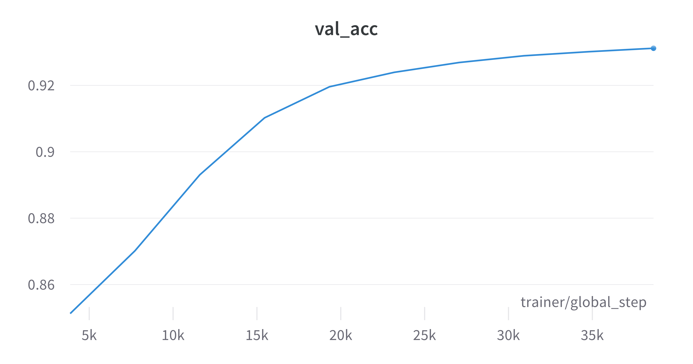
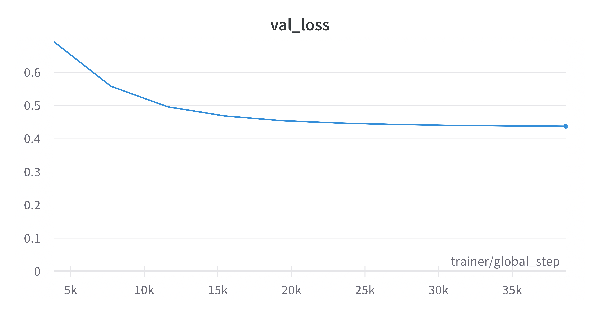

# Tennis Prediction
With [data generously maintained by Jeff Sackmann](https://github.com/JeffSackmann/tennis_atp), I built some 
machine learning algorithms to predict upcoming winners from upcoming tennis matches.  

My driving question in this project is can I predict tennis match winners and 
use those predictions to win at online betting houses such as Pinnacle Sports and Bet365.
My source of betting odds may be found at http://www.tennis-data.co.uk/alldata.php. 
All of these predictions are run by the betting houses and are the basis of the betting odds. In addition, the bookmaker's odds 
not set to add to 100%, but a little higher, 102 or 103%. The addition gives the bookmaker an
edge however the bet goes. Occasionally, the betting house will adjust the odds to make
the bet more attractive. Perhaps a blowout is expected, and the betting house will
give more favorable odds to balance out the bets. A nice paper by [Kaunitz, Zhong, and Kreiner](https://arxiv.org/abs/1710.02824) 
tracked when the betting odds deviated from the expected average and their strategy was quite
successful until the betting houses found out what they were up to. 

In predicting match winners, an important factor was creating a good statistic representing
a player's skill. Tennis ranking points are awarded based on the tournament and are lost after 52 weeks. From chess, 
the ELO score is calculated relative to the opponent's ELO. It also has memory based on previous wins and losses. 
I chose to use ELO, but an interesting score to explore is the Glicko score, which has been suggested
to be an improvement from ELO. Glicko-2, includes a rating volatility term, which can be seen as a player's consistency or 
variance in the rating. 

Betting strategies involving the Kelly Criteria was tackled by Sipko's thesis [Machine Learning for the Prediction of Professional Tennis Matches](https://www.doc.ic.ac.uk/teaching/distinguished-projects/2015/m.sipko.pdf).
Simple strategies involve betting below a threshold. More sophisticated strategies involve
calculating the optimal amount to bet based on the probability of winning and the 
houses' betting odds. 

At the moment, I provide the code to predict the winners, but not the betting predictions. 

## Setup 
Pull the [repo](https://github.com/JeffSackmann/tennis_atp) in a location of your choosing. Record the location.

## How to Run
Set the pythonpath to the project directory:
    export PYTHONPATH=/path/to/tennispredictor/

Activate the virtual environment.
Create virtual environment with using pip or conda. 
For example with pip:
    python -m pip install -r requirements.txt

## Clean Data
The clean data script consolidates CSVs, removes null values, converts strings to numeric and calculates an ELO score, which
from the literature is more predictive than tennis ranking. 

    python preprocessing/clean_data.py --tennisdir "/path/to/data/tennis_atp" --datadir "/path/to/your/data/directory"

## Train Model
To train the MLP

    python main/train.py --csv "/path/to/your/data/directory/atp_database.csv"

## Classifiers
Traditional classifiers include Nearest Neighbors, Linear SVM, Gaussian Process, Decision Tree,
Random Forest, Neural Net, AdaBoost, Naive Bayes, and QDA.

To train traditional classifiers on the data, run

    python main.classifier.py --csv "/path/to/your/data/directory/atp_database.csv"  
    --rootdir "/path/to/your/data/directory"

where `rootdir` is your results directory. 

The classifiers are saved based on `timestring`.  

To predict on your trained classifiers, run

    python main.classifier.py --csv "/path/to/your/data/directory/atp_database.csv"  
        --rootdir "/path/to/your/data/directory" 
        --timestring "timestring of your trained classifier"
        --classifier_name "Name of your classifier"

## Deploy on New Data
To predict on new matches, run 

    python preprocessing/generate_deploy.py

This script saves a file called `deploy.csv` which can be used in lieu of 
atp_database.csv.

To deploy on a classifier, replace csv with the output of generate_deploy.py.  

To deploy on the neural network, run

    python main/deploy.py --csv /path/to/csv
    --ckpt_path /path/to/model
    --rootdir /path/to/your/analysis/dir

## Results

Classifiers predicted matches in the test set with over 90% accuracy. This seems high, 
I'm surprised a match could be predicted with such confidence. I plan to check on outside datasets. 

### Machine Learning

Trained with Pytorch Lightning, the model leveraged Adam with a learning rate of 1e-6, with a 
batch size of 128 matches reached 93.1% accuracy. 

Test Set Score:
- 0.931

From Wandb, the validation accuracy over training is:

The loss curve is shown below:

### Classifiers

Test Set Scores:
- Linear SVM 0.927
- Decision Tree 0.920
- Random Forest 0.871
- AdaBoost 0.926
- Neural Net 0.900
- Nearest Neighbors 0.715
- Naive Bayes 0.930
- QDA 0.917

The classifiers scored between 90-92% accuracy on the test set save for the Nearest Neighbors
classifier, perhaps due to the high dimensionality of the feature space. 

Analyzing feature importances with permutations and Mean Accuracy Decrease, scoring with
Negative Mean Squared Error, it seems winning streaks and losing streaks were critical across
all classifiers. ELO, handedness, and seed affected some classifiers. 

 